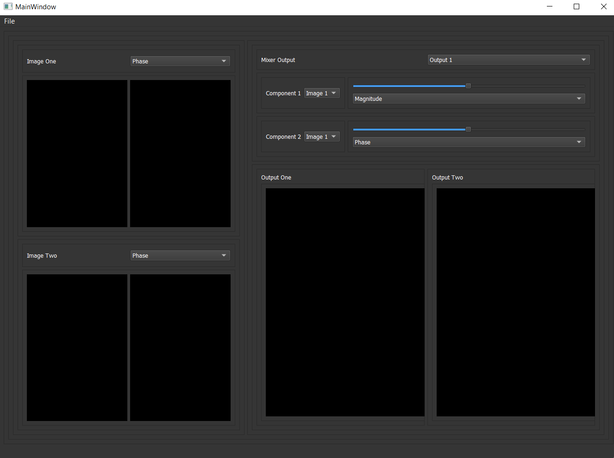
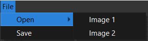
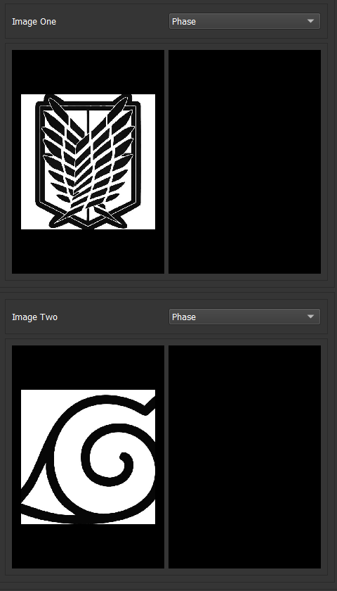
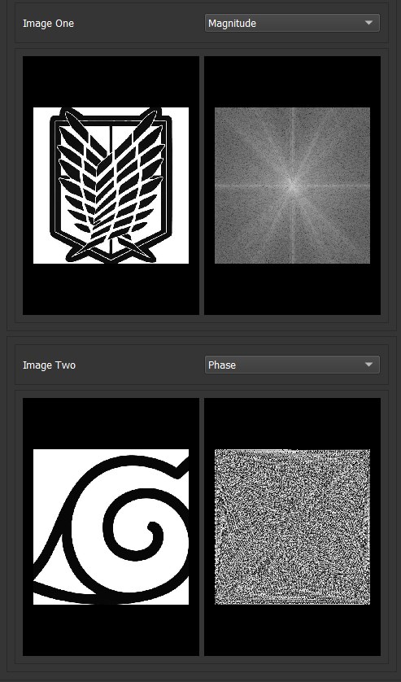
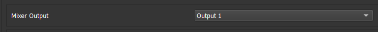
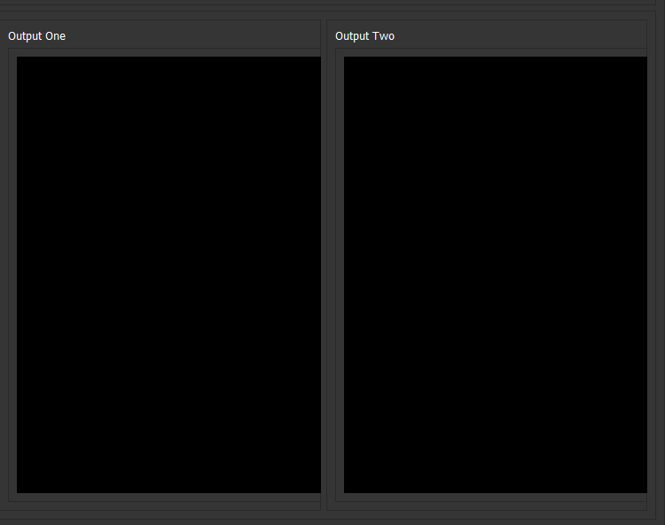
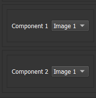
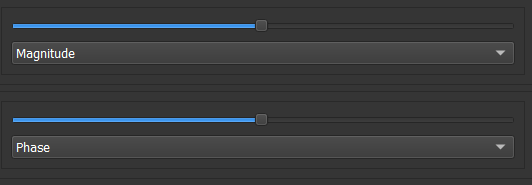
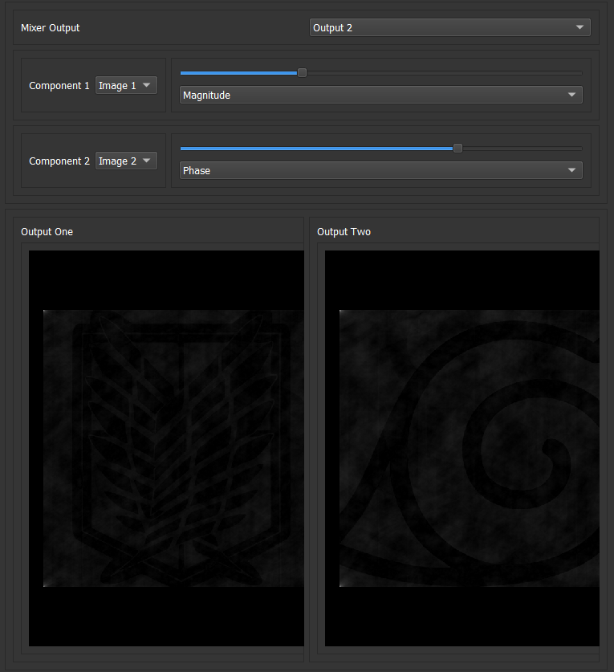
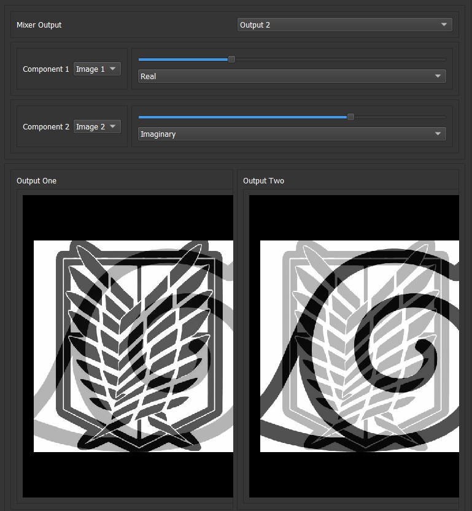

## Task 3
**Name:Rawan Sayed Badr**  
**ID: 30**  

## Welcome to my ImageMixer Software
 

## Begin with Left Side of my ImageMixer Software 
**Step 1: Uploading Image 1 and Image 2**  
  
  
**Step 2: you can get FT-(Magnitude/Phase/Real/Imaginary) from Combobox next to each Image**  

## Here is Right(Mixer) Side of my ImageMixer Software 
**Step 1: Choose from Combobox next to MixerOutput (Output1/Output2) Where you want mixed image to appear**  
  
  
**Step 2:Choose from Combobox next to (Component1/2) which images I want to mix**  
  
**Step 3:Change Slider to get the ratio you want to mix from each Component**  
**By Default :50% from each Slider**  
  
**Step 3:Choose what you want to mix from each image**   
**Options:**  
**Combo box 1:Magnitude with Combo box 2: Phase or UniformPhase**  
**Combo box 1:Phase with Combo box 2: Magnitude or UniformMagnitude**  
**Combo box 1:UniformMagnitude with Combo box 2: Phase or UniformPhase**  
**Combo box 1:UniformPhase with Combo box 2: Magnitude or UniformMagnitude**  
**Combo box 1:Real with Combo box 2: Imaginary**  
**Combo box 1:Imaginary with Combo box 2: Real**  
**By Default : Combo box 1 is Magnitude and Combo box 2 is Phase**   

## Example 1: 
**Mixing (0.7 Magnitude from Image 1 with 0.3 Phase from Image 2) and show it in Output1**  
**Mixing (0.3 Magnitude from Image 1 with 0.7 Phase from Image 2) and show it in Output2**  

## Example 2: 
**Mixing (0.7 Real from Image 1 with 0.3 Imaginary from Image 2) and show it in Output1**  
**Mixing (0.3 Imaginary from Image 1 with 0.7 Real from Image 2) and show it in Output2**  

